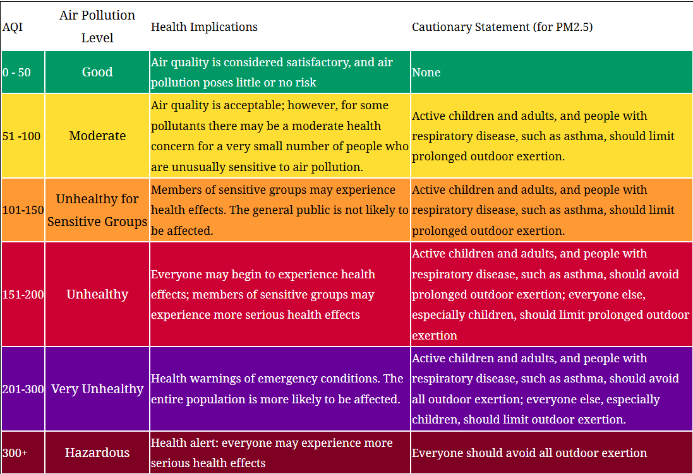

# Ecoguard-jp-api
Monitor air quality and environmental conditions across Japan in real time.

Get instant alerts when pollution levels or atmospheric conditions reach
dangerous thresholds (rule-based) or show abnormal trends over time (PyTorch anomaly detection), 
and request an intelligent bulletin on any time period to explore hypotheses about what
happened and why.

Monitored Factors 
-----
1. **Air Quality / WAQI** 
- Air quality is reported using the AQI (Air Quality Index), an official scale
that aggregates multiple pollutants into a single value.
- Source and visual reference: https://aqicn.org/scale/

The following pollutants are also stored individually in the database to support analysis:
PM2.5 (fine particles), PM10 (coarse particles), NO2 (nitrogen dioxide), O3 (ozone).

2. **Weather / Open-Meteo**
- Temperature and humidity are monitored via Open-Meteo and trigger independent alerts.
- Source: https://open-meteo.com/

In total, 3 alert indices are monitored with alerts — AQI, temperature and humidity —
based on 7 environmental criteria : AQI, PM2.5, PM10, NO2, O3, temperature and humidity.

Intelligent Bulletin
-----
On any time period, request a bulletin that analyses all available factors
and formulates hypotheses about observed anomalies. The bulletin is generated by an LLM 
and available as a downloadable PDF.

Bulletins contain hypotheses based on available data, not scientific conclusions.

Rate limited to 3 bulletins per day per IP address.

API
-----
* GET/readings > Latest sensor readings for all cities
* GET/alerts > Latest alerts (spikes and trends)
* POST/bulletins > Generate a bulletin PDF for a given period
* GET/tasks/{task_id} > Check bulletin generation status and retrieve result

Database
-----
* sensor_readings
city, timestamp, aqi, pm25, pm10, no2, o3, temperature, humidity

* alerts
city, timestamp, alert_type (spike/trend), parameter, value, threshold, anomaly_score

Stack
-----
* FastAPI
* Pydantic
* Celery + Celery Beat
* Redis 
* PyTorch (CPU - considered sufficient for LSTM anomaly detection for this project)
* WeasyPrint
* PostgreSQL
* SQLAlchemy 
* Alembic
* Docker 

Setup in Local
-----
1. Clone the repository
2. Create and activate a virtual environment
3. Install dependencies: `pip install -r requirements.txt`
4. Copy `.env.example` to `.env` and fill in your values
5. Create a PostgreSQL database and update `DATABASE_URL` in `.env`
6. Run migrations: `alembic upgrade head`
7. Start Redis (via Docker): `docker compose up redis -d`
8. Start the API: `uvicorn app.main:app --reload`
9. Start the Celery worker: `celery -A worker.celery_app worker --loglevel=info --pool=solo`
10. Open API docs: `http://localhost:8000/docs`

Setup in Docker
-----
Coming soon

Future Improvements
-----
* Pytest for routers, tasks, and the anomaly detector
* Alert thresholds: currently a single threshold per parameter. 
  Planned: multiple alerts for AQI:
  - 51–100 Moderate
  - 101–150 Unhealthy for sensitive groups
  - 151–200 Unhealthy
  - 201–300 Very Unhealthy
  - 300+ Hazardous
* Bulletin analysis: integrate a LangChain Python REPL agent for deeper statistical analysis 
(averages, trends, city comparisons) before the LLM synthesis
* City filtering: add query parameter to /readings and /alerts endpoints
