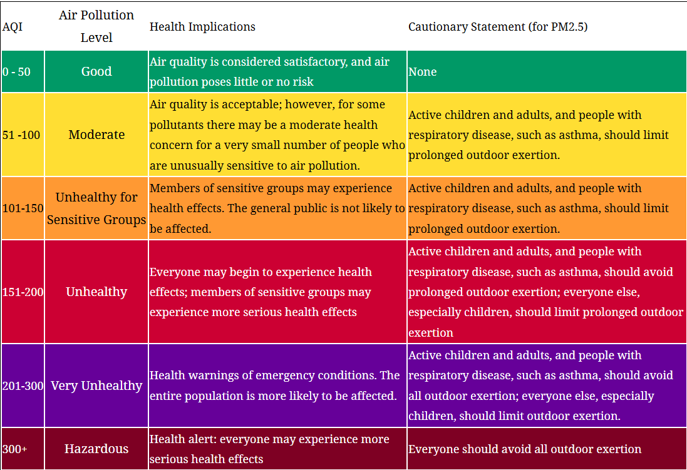

# Ecoguard-jp-api
Monitor air quality and environmental conditions across Japan in real time.

Get instant alerts when pollution levels or atmospheric conditions reach
dangerous thresholds (rule-based) or show abnormal trends over time (PyTorch anomaly detection), 
and request an intelligent bulletin on any time period to explore hypotheses about what
happened and why.

Deployment
-----
This API is deployed on Railway.
Swagger UI: https://ecoguard-jp-api-production.up.railway.app/docs

Monitored Factors 
-----
1. **Air Quality / WAQI** 
- Air quality is reported using the AQI (Air Quality Index), an official scale
that aggregates multiple pollutants into a single value.
- Source and visual reference: https://aqicn.org/scale/

The following air quality components are also stored individually in the database to support analysis:
PM2.5 (fine particles), PM10 (coarse particles), NO2 (nitrogen dioxide), O3 (ozone).

2. **Weather / Open-Meteo**
- Temperature and humidity are monitored via Open-Meteo and trigger independent alerts.
- Source: https://open-meteo.com/

In total, 3 alert indices are monitored with alerts — AQI, temperature and humidity —
based on 7 environmental criteria : AQI, PM2.5, PM10, NO2, O3, temperature and humidity.

Monitoring 8 major Japanese cities: Tokyo, Osaka, Kyoto, Nagoya, Sapporo, Fukuoka, Hiroshima and Sendai.

Intelligent Bulletin
-----
On any time period, request a bulletin that analyses all available factors
and formulates hypotheses about observed anomalies. The bulletin is generated by an LLM 
and available as a downloadable PDF.

Bulletins can be generated for all 8 cities or filtered by a specific city.

Bulletins contain hypotheses based on available data, not scientific conclusions.

Rate limited to 3 bulletins per day per IP address.

**Example**: Below is a sample bulletin generated from a single day of real environmental data.

[View sample bulletin (PDF)](docs/ecoguard_bulletin.pdf)

How to generate a bulletin
-----
1. Call POST /bulletins with a date_start / date_end, and optionally a city
2. In the response body, find the task_id value and copy it
3. Go to GET /tasks/{task_id}, click Try it out, paste the task_id in the field, click Execute
4. Check the status field in the response (if PENDING, wait a few seconds and execute again)
5. Once the status is SUCCESS, go to GET /tasks/{task_id}/download, click Try it out, paste the same task_id, click execute, then download to save the PDF

Webhook
-----
Register a Discord webhook URL to receive real-time alerts in your Discord channel.
Call POST /webhook with your Discord webhook URL.

Database
-----
* sensor_readings > 
city, timestamp, aqi, pm25, pm10, no2, o3, temperature, humidity

* alerts > 
city, timestamp, alert_type (spike/trend), parameter, value, threshold, anomaly_score

Data is appended on every hourly and never replaced, 
the historical records are required for trend detection and bulletin analysis.

Stack
-----
* FastAPI
* Pydantic
* Celery + Celery Beat
* Redis 
* PyTorch (CPU - considered sufficient for LSTM anomaly detection for this project)
* WeasyPrint
* PostgreSQL
* SQLAlchemy 
* Alembic
* LangChain
* Docker 

Setup in Local
-----
1. Clone the repository
2. Create and activate a virtual environment
3. Install dependencies: `pip install -r requirements.txt`
4. Copy `.env.example` to `.env` and fill in your values
5. Create a PostgreSQL database and update `DATABASE_URL` in `.env`
6. Run migrations: `alembic upgrade head`
7. Start Redis (via Docker): `docker compose up redis -d`
8. Start the API: `uvicorn app.main:app --reload`
9. Start the Celery worker: `celery -A worker.celery_app worker --loglevel=info --pool=solo`
10. Open API docs: `http://localhost:8000/docs`

Setup with Docker
-----
See Deployment section: the app is deployed via Docker on Railway.

